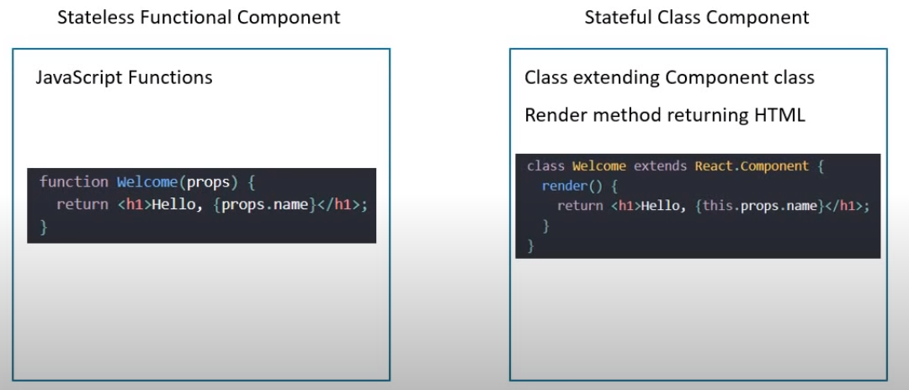

---
# ReactJS-course (v16.13)
---

# **Create React APP**

---

## Way 1

> Documentation [Github Official Documentation](https://github.com/facebook/create-react-app)

### Step 1

Create a app using the following command

```cmd
~$ npx create-react-app hello-world
```

> if The app deletes the project file immediately after the creating the app. Then try the below command out.

```cmd
~$ npm install -g create-react-app@latest   [if required]
```

### Step 2

Navigate terminal to the folder just created

```cmd
~$ cd hello-world
```

### Step 3

Start the npm

```cmd
~4 npm start
``
```

---

## Way 2

Globally

```cmd
npm install create-react-app -g
```

Create app

```cmd
~$ create-react-app <ProjectName>
```

---

### Way 1 is better and easier to handle

---

# **Folder Structure**

---

## `public` Folder

`node_modules/public/index.html` this file is very important

> In this file `<div id="root"></div>` is responsibe for UI of our app. React will handle this part of its own. We should not modify this `div`

## `src` Folder

This folder is using most during development

> `index.js` specify the root components which is app component and dom element which will be controll by react.

> `document.getElementById("root")`. Here `root` id is the id inside `public/index.html` which is `<div id="root"></div>`

> App componets represents view which we see in the browser.

> `App.css` for styling

> `App.test.js` file for unit test. Contains test cases.

> `index.css` which applied styles in body tag

> `logo.svg` reference in app component

> `serviceWorker.js` concern with progressive web app. For beginner this file is ignored.

---

# **Components**

---

> Part of the UI

> Reusable and can be nested inside other components


> Component codes write in `js` file. For example, `App` component has `App.js` file.

> Components have extension like `js` or `jsx` but in this tutorial I am focussing in just `.js`

## Component Types

2 Types

- Stateless Functional Component
- Statefull Class Component



---

# **Functional Components**

---


## Now create a very first functional component

> Create a folder `src/components`

> Create a file `src/components/Greet.js`

### Step 1

create a functional component

`Greet.js`

```js
import React from "react";

/*
function Greet() {
  return <h1>Hello Imrul</h1>;
}
*/

const Greet = () => <h1>Hello Imrul</h1>; //ES6 syntax

export default Greet;
```

> `Greet` function is exported to use outside.

### Step 2

`App.js`

```js
import React from "react";
import logo from "./logo.svg";
import "./App.css";
import MyGreet from "./components/Greet";

function App() {
  return (
    <div className="App">
      <MyGreet></MyGreet>
    </div>
  );
}
export default App;
```

> Here we import the component first using `import Greet from "./components/Greet";`

> Then we use our custom `<Greet></Greet>` tag which is pretty unique feature.

---

## Note:

> `export default Greet;` here `default` allows us to call with any name when `importing`

> in `App.js` we named it `MyGreet` as my own. But we have to specify the location of the file like `"./components/Greet";`

### Example

`Greet.js`

```js
import React from "react";
export const Greet = () => <h1>Hello Imrul</h1>;
```

`App.js`

```js
import { Greet } from "./components/Greet";
```

> Here we can we see we must import with exact same name in `Greet.js` file. We have to use `{}` to pass import it in that manner.

> We have no freedom to use our own name in other files.

> So this is the powet of using `default` when exporting.

---

# **Class Components**

---


### Step 1

```js
import React, { Component } from "react";

class Welcome extends Component {
  render() {
    return <h1>Class Component</h1>;
  }
}

export default Welcome;
```

> In class component we need to specify two imports. one is `React`, other one is `{ Component }`.

> And the class should extends the `Component` class.

> Thirdly, we exported the class in `export default Welcome;` line.

### Step 2

```js
import React from "react";
import logo from "./logo.svg";
import "./App.css";
import MyGreet from "./components/Greet";
import Welcome from "./components/Welcome";

function App() {
  return (
    <div className="App">
      <MyGreet></MyGreet>
      <Welcome></Welcome>
    </div>
  );
}

export default App;
```

> Here we imported `import Welcome from "./components/Welcome";`

> And we heve our own `tag` which is `<Welcome></Welcome>`

---

## Advantage of Components


> So far we have learn about `App.js`, `Greet.js` and `Welcome.js`.

> We returns some html inside components. this is not regular `html`. It's known as `jsx`

---

# **Hooks Update**

---

> Documentation: [Hooks](https://reactjs.org/docs/hooks-intro.html)


---
